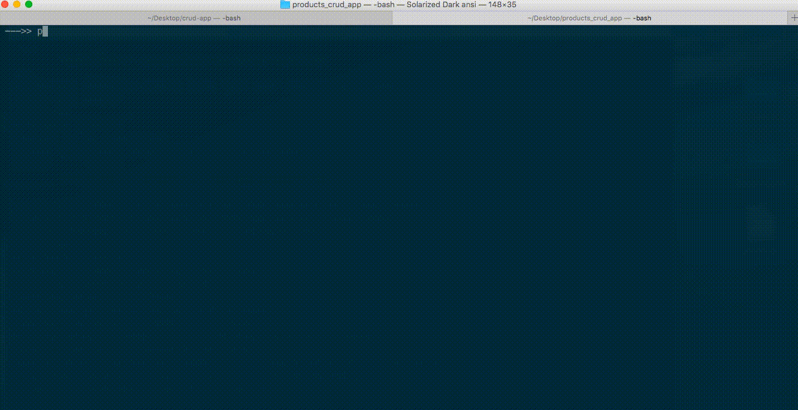
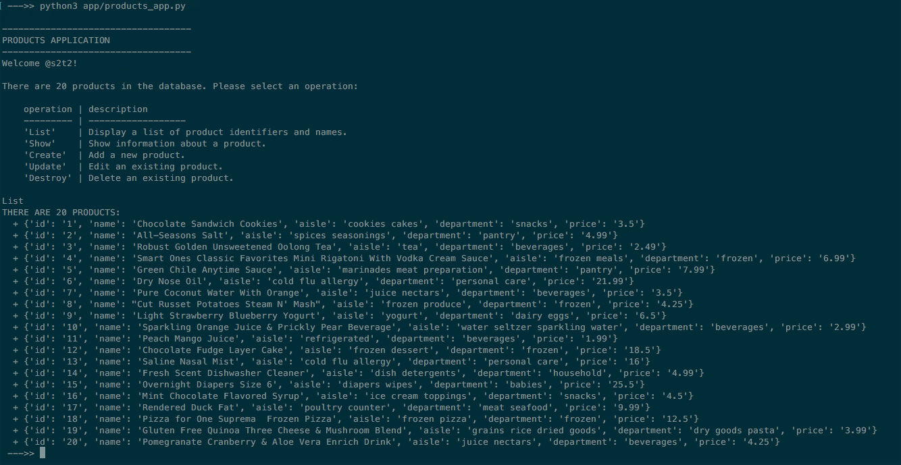
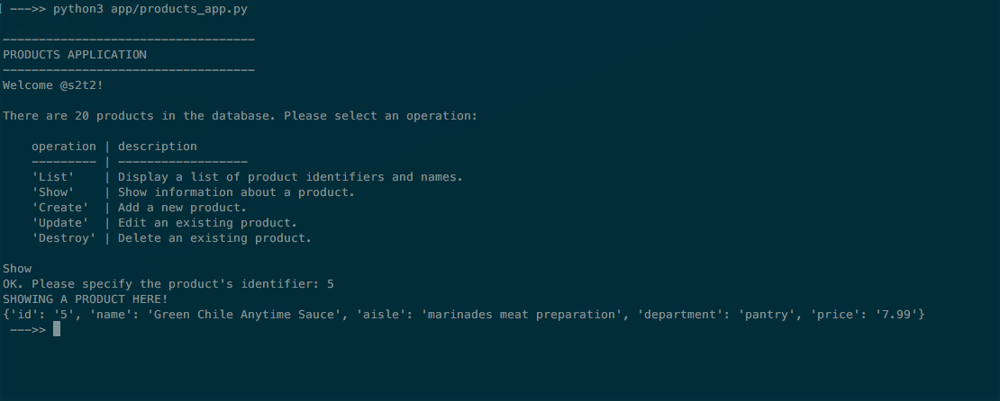
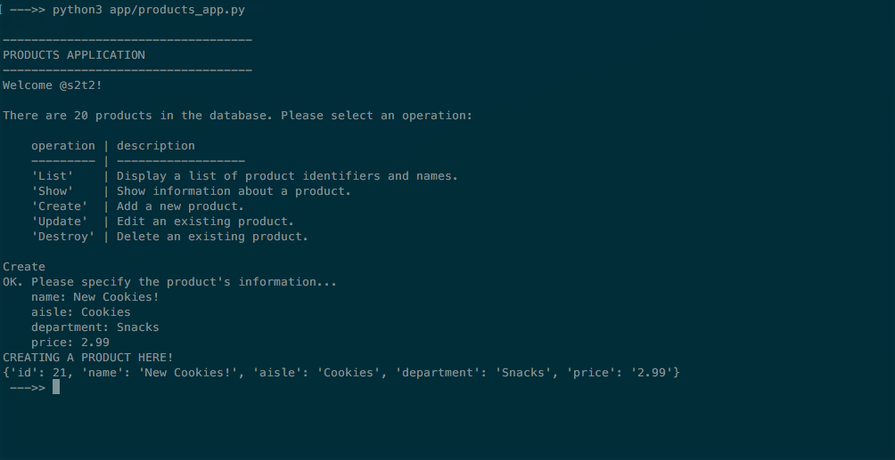
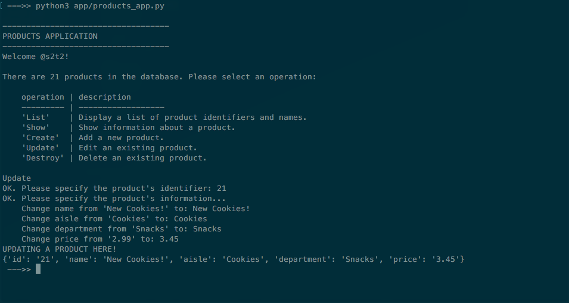
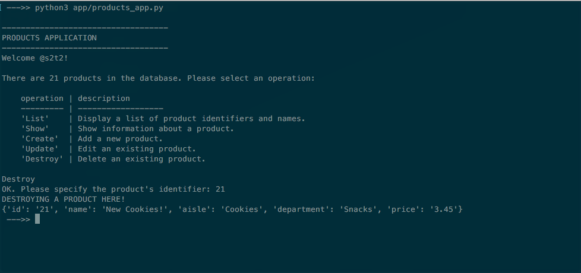

# CRUD Application w/ CSV File Datastore

Your local corner grocery store has hired you to help them modernize their checkout system.

After providing the store owner with an awesome checkout application, the store owner now asks you to provide an application which will help store managers keep track of their inventory of products. The store owner would like to use the application at each of a small handful of store locations, each of which has its own product inventory.

Write a Python program to perform CRUD operations on an inventory of products kept in a CSV file.

> NOTE: CRUD is an acronym for "Create", "Read", "Update", and "Destroy". These operations represent the primary actions performed on database resources (i.e. records) within an information system. The "Read" operation comprises two operations: the "List" operation for reading all resources, as well as the "Show" operation for reading a single resource.



The non-moving version :smile: :

List



Show



Create



Update



Destroy



> NOTE: Don't be constrained by the images above. Feel free to create your own user interface and experiences.

## Learning Objectives

  1. Gain familiarity with the concept of CRUD operations.
  1. Gain familiarity with the concept of program/data independence.
  1. Practice writing software in Python.
  1. Practice reading and writing CSV files in Python.
  1. Practice version control.
  1. Practice contributing to open source software.

## Prerequisites

  1. ["Shopping Cart" Project](/projects/shopping-cart/project.md)
  1. [Python `csv` Module Overview](/notes/programming-languages/python/modules/csv.md)

## Requirements

Your program should meet the requirements set forth in the sections below.

### Repository Requirements

The program's source code should be hosted on GitHub.com in its own repository which uses the following conventions:

  + Contains a `README.md` file which provides instructions for how to install and use the program.
  + Contains a `app/products_app.py` file which represents the Python program.
  + Contains an empty `data` directory except for presence of a `data/.gitignore` file (see setup instructions).
  + Contains a commit history which reflects incremental development progress, perhaps corresponding with the checkpoint steps.

### Datastore Requirements

The program should interface with an inventory of products kept in a CSV file named `data/products.csv`, however this CSV file should not be tracked in version control (see setup instructions).

The program should assume existence of the CSV file in the specified location. And it should assume the CSV file contains the proper header row:

    id,name,aisle,department,price

The program should function even if the CSV file contains no additional rows besides the header row. This would correspond to a situation where there are no products in the inventory.

The program should function regardless of the order of rows in the CSV file.

### Interface Requirements

The program should display a user interface which contains:

  + A friendly greeting message including a user name of choice.
  + The number of products currently in inventory.
  + A list of all available operations (e.g. "List", "Show", "Create", "Update", and "Destroy") and instructions for how to select one.

### CRUD Operation Requirements

The program should prompt the user to select one CRUD operation at a time (e.g. "List", "Show", "Create", "Update", or "Destroy"). If an unrecognized operation is selected, the program should fail gracefully by displaying an "Unrecognized Operation" message to the user. Otherwise it should perform the selected operation in accordance with the following expectations, prompting the user for additional inputs as necessary:

  + The **List** operation should print information (identifiers and names at least) about each product in the inventory.
  + The **Show** operation should prompt the user for a product identifier. If the product identifier matches the identifier of an existing product in the inventory, the program should print all available information about that product.
  + The **Create** operation should prompt the user to input a new product's `"name"`, `"department"`, `"aisle"` and `"price"`, and should automatically determine the new product's `"id"` by adding 1 to the greatest identifier currently in the inventory. Then the program should save the new product's information by adding a new row at the bottom of the CSV file.
  + The **Update** operation should prompt the user for a product identifier. If the product identifier matches the identifier of an existing product in the inventory, the program should prompt the user to input new values for that product's `"name"`, `"department"`, `"aisle"` and `"price"` attributes, and overwrite that product's corresponding row in the CSV file.
  + The **Destroy** operation should prompt the user for a product identifier. If the product identifier matches the identifier of an existing product in the inventory, the program should display a helpful message and remove that product's corresponding row from the CSV file.

The "Show", "Update", and "Destroy" operations should each fail gracefully (i.e. display a friendly "Product Not Found" message) if no product matches the specified identifier.

### Further Exploration - Validations

For students desiring optional further exploration, the program's "Create" and "Update" operations should validate product information input by the user, focusing on ensuring prices are in the proper numeric format. The program should display a helpful message (e.g. "Please input a price formatted as a number with two decimal places.") when necessary.

After focusing on validating prices, optionally devise a better system for standardizing aisle and department names, and provide the user with a list of available values for each during the "Create" and "Update" operations.

### Further Exploration - Refactoring

For students desiring optional further exploration, the program's source code should be simplified, or "refactored" to contain at most a minimal amount of duplication. The program should conform to the "DRY" principle, which means "Don't Repeat Yourself".

### Further Exploration - Testing

For students desiring even more optional further exploration, the repository should contain one or more "tests" which communicate and verify the functionality of one or more of the program's functions.

The test file(s) should exist inside a new `tests` directory, and should be implemented using the `pytest` package.

In order to test the program, much of its source code should first be refactored into functions to remove as much source code as possible from the program's global scope. This enables the resulting functions to be individually invoked and tested.

## Instructions

### Setup

Create a new project repository on GitHub.com and note its remote clone address. Clone it to your Desktop or some other location on your local machine. Navigate into the project repository via the command line.

Create in the project repository the following files:

  + `README.md`
  + `app/products_app.py`
  + `data/.gigitnore`

In the `README.md` file, place content to identify your application and instruct someone else how to download and run it:

    # Name of Your App

    Some description or other info about what the app does.

    ## Installation

    Download the source code:

    ```shell
    git clone remote_clone_address_of_your_repo_here
    cd some/path/to/repo/
    ```

    Finally, download the [example `products.csv` file](https://raw.githubusercontent.com/prof-rossetti/nyu-info-2335-70-201706/master/projects/crud-app/products.csv) and save it as `data/products.csv`.

    ## Usage

    ```shell
    python app/products_app.py
    ```

In the `app/products_app.py` file, place some placeholder print statement, like `print("HELLO")`.

In the `data/.gitignore`, place the following code, which says "exclude from version control all files in this directory besides this one":

    *
    !.gitignore


Commit your changes to version control using a message like "Setup new project repo".

Finally, download [the `products.csv` file](products.csv) into your repository's `data` directory so its name is `data/products.csv`. You can achieve this by updating your local fork of the course repository and copying the file from there (recommended), or by copying the file's ["raw" contents](https://raw.githubusercontent.com/prof-rossetti/nyu-info-2335-70-201706/master/projects/crud-app/products.csv) from GitHub and pasting them into a new local file (easier, and acceptable due to the small size of our file). Your application will read and write to this file, so there is a chance it may get messed up during application development. So you are encouraged to also download a redundant copy, perhaps called `products_copy.csv` into the `data` directory, to have on-hand in case you ever need to re-paste its contents into the main `products.csv` file.

After downloading the CSV file(s), you should not see them tracked in version control. If you do, make sure to configure the `data/.gitignore` file as prescribed above. Alright, you are ready to start development!

### Implementation

#### Checkpoint I - User Inputs

  1. Print a menu which contains a greeting message and a hard-coded number of products and a list of available operations.
  1. Using the aforementioned menu, prompt the user to choose one of the available operations, and print the name of the chosen operation.
  1. Implement a single "handler" function to recognize the chosen operation and invoke one of a handful of new operation-specific functions to perform the chosen operation. For example, if the user chooses "Create", have your "handler" function invoke a function called `create_product()` to print the name of the chosen operation.
  1. Handle invalid operation inputs by displaying a helpful message like "Unrecognized Operation. Please choose one of: 'List', 'Show', 'Create', 'Update', or 'Destroy'."

After demonstrating your ability to properly prompt the user for inputs, feel free to comment-out all your user input-related code as you move on to implementing and testing the remaining functionality. If you do, remember to un-comment the input-related code and hook it back up to the remaining functionality once implemented.

#### Checkpoint II - Reading and Writing to CSV File

Reading:

  1. Demonstrate your ability to print the entire contents of the inventory CSV file.
  1. Demonstrate your ability to loop through each product in the inventory and print the name of each.
  1. Demonstrate your ability to print the number of products in the inventory.
  1. Re-configure the user input menu to use the real number of products instead of a hard-coded value. This will require you to read the CSV file before prompting the user for inputs.

Writing:

  1. Write some random content to a temporary file, perhaps named `data/writing-stuff.csv`.
  1. Read the existing inventory of products from `products.csv` and write to a separate, temporary file, perhaps named `data/writing-products.csv`.
  1. Read the existing inventory of products from `products.csv` and overwrite that same file with its original contents.

#### Checkpoint III - CRUD Operations

  1. Implement the "List" operation.
  1. Implement the "Show" operation.
  1. Implement the "Create" operation.
  1. Implement the "Destroy" operation.
  1. Implement the "Update" operation last, as it uses a combination of techniques shared with the "Show" and "Create" operations.

## Submission Instructions

Push your changes to your remote project repository on GitHub.com, and note its URL.

Update your fork of the course repository. In the [submissions.csv file](submissions.csv), add a new row including your GitHub username and the project repository's URL. The CSV file's rows should be ordered alphabetically by GitHub username. Commit your changes to your fork of the course repository and submit a Pull Request for your fork's content to be merged into the course repository. See the [Contributor's Guide](/CONTRIBUTING.md) for instructions. At this time, you are encouraged to use the Git CLI to submit your work.

## Evaluation

Full credit for presence of a Python program which runs without error, meets all or almost all requirements, and exactly or near-exactly produces the desired functionality.

Else 87.5% credit for presence of a Python program which runs without error, meets most requirements, and produces most of the desired functionality.

Else 75% credit for presence of a Python program which runs without error, meets most requirements, and produces much of the desired functionality.

Else half credit for presence of a Python program which doesn't run or doesn't meet the requirements, or doesn't produce much of the desired functionality.

Else no credit.
