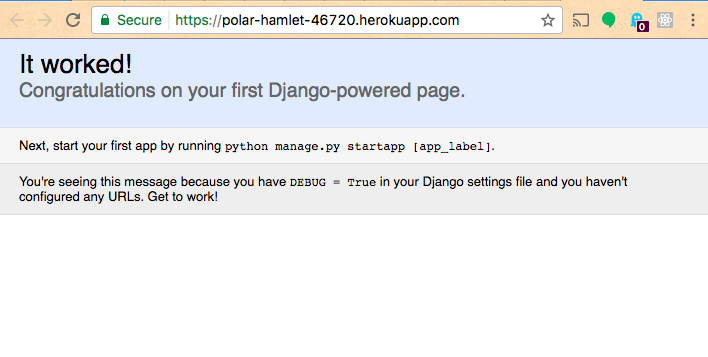

# Freestyle Project Example - CRUD Application w/ Web Interface and SQL Database (Django and PostgreSQL Implementation)

## Provisioning a Heroku Server

This guide is adapted from the [Deploying Python Applications on Heroku Article](https://devcenter.heroku.com/articles/deploying-python).

### Heroku Setup

Create a new account on [Heroku.com](https://heroku.com), or use an existing one.

Download the [Heroku Toolbelt CLI](https://devcenter.heroku.com/articles/heroku-cli) unless you have already done so.

Login to Heroku from the CLI unless you have already done so:

```shell
heroku login # then enter your Heroku username and password (and optionally enter your MFA code)
```

Provision a new Heroku server:

```shell
heroku apps:create example-groceries-system-django # use your own unique name instead of `example-groceries-system-django`, or omit the name and heroku will choose a fun one for you
```

In addition to provisioning a new server, this automatically associates our project repository with a new remote address which corresponds with that server's address. Run `git remote -v` to verify its existence.

### Deploying

Deploy the application's source code to the Heroku server:

```shell
git push heroku master
```

You may see an error message like:

    Error while running '$ python manage.py collectstatic --noinput'.

To fix it, follow further guidance from the remainder of the error message which instructs us to run:

```shell
heroku config:set DISABLE_COLLECTSTATIC=1 # this configures the server to not attempt to run something called collectstatic ... whatever that is.
```

Try to re-deploy:

```shell
git push heroku master
```

Sweet. Deploy success. You can now expect your application to be publicly-available on the Internet.

### Visiting Production Application

Visit the application "in production" at the remote server's URL. If you forget what it is, you can run the following from the repository's root directory:

```shell
heroku open # this will open the application in a new browser window
```


Not Good. The error message says something about the logs, so anytime we need to check our remote server's logs, we can run:

```shell
heroku logs
```

We see an error in the logs saying something like "No web processes running". We need to configure our remote server to run a web process, or "webserver".

### Declaring Processes

Log in to the Heroku.com application management dashboard, find your application in the list, and click on it to visit its management console. Click on the "Resources" tab and find a helpful message in the "Dynos" section saying something like "This app has no process types yet. Add a Procfile to your app in order to define its process types." And click to [learn more](https://devcenter.heroku.com/articles/procfile) and [more](https://devcenter.heroku.com/articles/python-support#process-types) and [more](https://devcenter.heroku.com/articles/django-app-configuration).

We need to add a specific file called `Procfile` to our repository, and inside it specify the following contents (perhaps specifying a different project name besides `my_grocery_system` to reflect the name of your Django project):

    web: gunicorn my_grocery_system.wsgi --log-file -

This specifies how the remote server should expect to run a webserver.

To ensure the `gunicorn` package gets installed on the remote server, add `gunicorn` to a new line in the `requirements.txt` file, then commit your changes.

Finally re-install packages (but make sure to activate the virtual environment before doing so):

```shell
# from within the (venv) virtual environment:
pip3 install -r requirements.txt  # or use normal pip instead of pip3
```

This is similar to what the remote server will do during the code deployment process.

Let's try to re-deploy our application in hopes we have fixed the application errors:

```shell
git push heroku master
heroku open
```


What? The error train keeps rolling. But at least we got past the other "web process" error. We're getting really close so thanks for hanging in there.

### Allowing Remote Host(s)

Let's examine this "disallowed host" error message to see what's going on.

It sounds like we have to add the production URL of our remote server to a variable called `ALLOWED_HOSTS` to allow the application to be run at that address. Sounds reasonable.

We can search the source code for a variable called `ALLOWED_HOSTS` and find it defined in a file called `settings.py`. Or we could perform a Google search for something like "Disallowed Host you may need to add to allowed hosts heroku django" to find [a StackOverflow answer](https://stackoverflow.com/a/40667600/670433) which suggests we look in the `settings.py` file as well.

So inside the `my_grocery_system/settings.py` file, add the URL of your remote server to the list of `ALLOWED_HOSTS`. For example:

```python
# ...

# use your remote server's URL instead of the example below
ALLOWED_HOSTS = ["polar-hamlet-46720.herokuapp.com"] # note lack of "https://" prefix

# ...
```

Commit your changes. Then re-deploy and visit the server's URL to see if it worked:

```shell
git push heroku master
heroku open
```



Wow. Deployment success. Go take a break. That was a lot debugging. Really great job.

Your project is now ready for development of functionality that will help it meet its stated objectives.

### Future Deployments

After implementing new functionality and testing the project in a local webserver, commit and deploy the changes to see them reflected on the production server:

```shell
git push heroku master
heroku open
```
