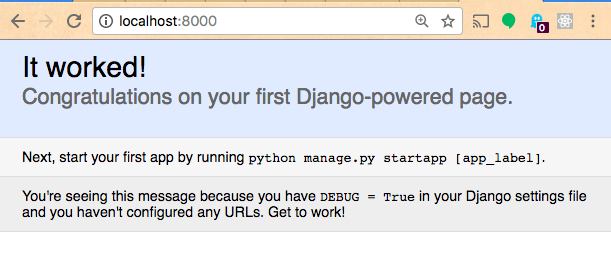

# Freestyle Project Example - CRUD Application w/ Web Interface and Database (Django and PostgreSQL Implementation)

## Setup

Adapted from the [Django Tutorial](https://docs.djangoproject.com/en/1.11/intro/tutorial01/) and the [Deploying a Django App to Heroku Article](https://devcenter.heroku.com/articles/deploying-python), which are both definitely worth following as well.

### Project Generation

First, ensure you have installed the `django` package, most likely using pip.

Navigate to your Desktop from the command-line. Then generate a new Django project:

```python
django-admin startproject my_grocery_system # my_grocery_system or some other name
```

Navigate inside your project directory and initialize a new git repository there, and commit your changes:

```shell
cd my_grocery_system
git init .
git add .
git commit -m "Generate new django app"
```

Take a moment to review the files created by the previous command. These files represent conventions of the Django framework. you will notice a subdirectory with the same name as the top-level repository name. Feel free to rename the top-level repository, but don't change the subdirectory's name. This subdirectory represents a Django "project".

> FYI: Django "projects" vs. "apps"
>
> What’s the difference between a project and an app? An app is a Web application that does something – e.g., a Weblog system, a database of public records or a simple poll app. A project is a collection of configuration and apps for a particular website. A project can contain multiple apps. An app can be in multiple projects. - [Django Tutorial](https://docs.djangoproject.com/en/1.11/intro/tutorial01/)

Add all the usual Python repository files (`README.md`, `requirements.txt`, etc.). In the `requirements.txt` file, place inside:

    Django

Commit again. We are ready to develop our project.

### Attempting to Run Local Webserver

Let's run a local webserver to visit our project in the browser:

```shell
python manage.py runserver
```

At this time, you might see an error like:

    ImportError: Couldn't import Django. Are you sure it's installed and available on your PYTHONPATH environment variable? Did you forget to activate a virtual environment?

Um, I mean I guess so. Django wants us to install a virtual environment. We can do so using the `virtualenv` package. Incidentally, if we want to eventually deploy our project to a Heroku server, Heroku also wants us to use `virtualenv`, so it's something we need to become familiar with.

### Using a Virtual Project Environment

From the project's root directory, initialize a new virtual environment specifically called "venv":

```shell
virtualenv venv
```

Take a moment to examine the files created by the previous command. They exist inside a new directory called `venv`, because that's what we named the project's virtual environment. Exclude all files in this directory from version control by adding `venv` on a new line inside a `.gitignore` file in the root project directory. Then commit with a message like "Generate virtual env".

Finally, activate the virtual environment:

```shell
# Mac OS Terminal:
source venv/bin/activate

# Windows Command Prompt:
venv\Scripts\activate
```

At any time, know you can de-activate the virtual environment:

```shell
deactivate
```

But we want to have it activated at the moment, so re-activate it at this time.

Notice your command-line prompt is now prepended with `(venv)`. This means commands we type are actually being executed inside our project's virtual environment. We need to re-install package dependencies at this time:

```shell
# from within the (venv) virtual environment:
pip install -r requirements.txt
```

This way, our virtual environment now has access to the `django-admin` command-line utility. So its time to re-attempt to run the local webserver.

### Re-attempting to Run Local Webserver

From within an active virtual environment, let's try running a local webserver again:

```shell
# from within the (venv) virtual environment:
python manage.py runserver
```

We see an error message in the terminal output about "unapplied migration(s)". But its OK. Because we also see a message like:

    ...
    Starting development server at http://127.0.0.1:8000/
    Quit the server with CONTROL-C.

This means our local webserver is running our project's source code on port `8000`. That means we can visit `localhost:8000` in a web browser to view our project's web interface.



Nice. Setup successful!

If after running the local webserver you see the files `db.sqlite3` and `my_grocery_system/__pycache__/`, add each to a new line within the .gitignore file to exclude them from version control. Then commit your changes with a message like "Demonstrate ability to run local webserver".
