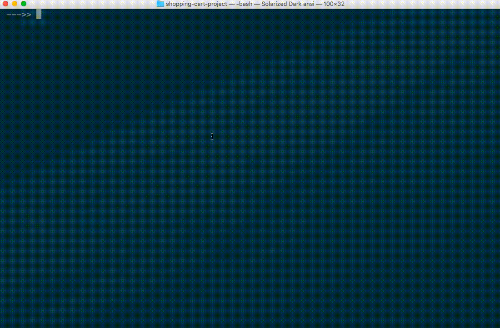
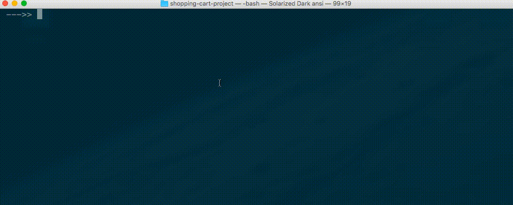
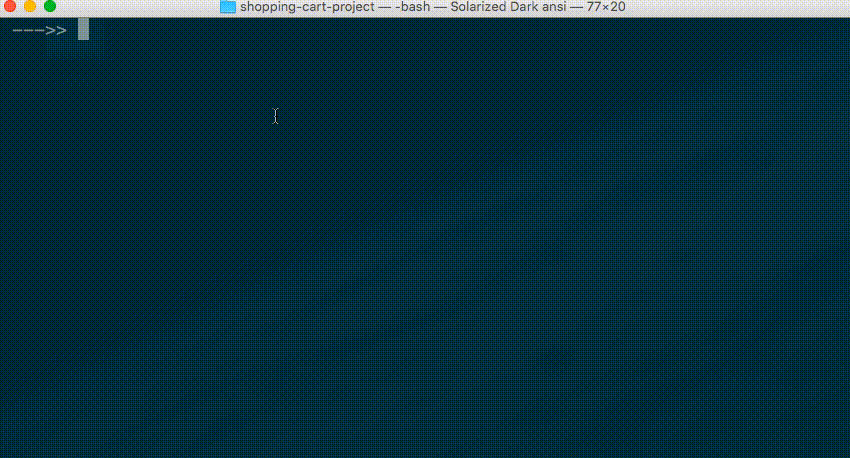
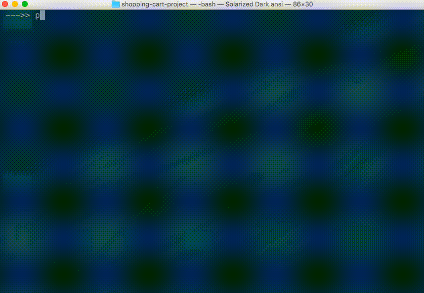

# Shopping Cart

Your local corner grocery store has hired you to help them modernize their checkout system.

Currently, the store affixes a price tag to each grocery item in stock. But the store owner wants to be able to change product prices at any given time. The store owner does not want to wait until all currently-priced items sell-out before being able to charge a different price for that type of item. And if there are any price tags that differ from prices charged at checkout, that would lead to confusion and a poor customer experience.

The store owner describes a desired checkout process which involves a clerk scanning each item's barcode to look up its price. You agree using a barcode scanner would be a helpful process improvement. The store owner says the barcode scanners are somewhat expensive, so it would be ideal to test out the process before making a hardware purchase.

You offer to write a Python program that can run on the clerk's computer at the checkout counter. The program will look up the prices of items based on the unique identifier of each. You explain that the store can use this software to process the unique identifiers provided as a result of the barcode-scanning process, if the owner eventually decides to purchases the barcode scanners.

To provide the program with information inputs, you ask the store owner to maintain a list of currently-offered products and the current price of each. You also ask the store owner to mark each product with a unique identifier instead of a hard-coded price tag. You explain the identifier can be used to look up the price of any given item.

The store owner agrees! Now it's time to write software to mimic the barcode-scanning process.



## Learning Objectives

  1. Practice writing software in Python.
  1. Practice contributing to open source software.
  1. Practice version control.

## Prerequisites

  1. ["Groceries" Project](/projects/groceries/project.md)

## Instructions

Write a program that asks the user to input one or more product identifiers, then looks up the prices for each, then prints an itemized customer receipt including the total amount owed.

The program should use the following dictionary to represent the store owner's database of products and prices:

```py
products = [
    {"id":1, "name": "Chocolate Sandwich Cookies", "department": "snacks", "aisle": "cookies cakes", "price": 3.50},
    {"id":2, "name": "All-Seasons Salt", "department": "pantry", "aisle": "spices seasonings", "price": 4.99},
    {"id":3, "name": "Robust Golden Unsweetened Oolong Tea", "department": "beverages", "aisle": "tea", "price": 2.49},
    {"id":4, "name": "Smart Ones Classic Favorites Mini Rigatoni With Vodka Cream Sauce", "department": "frozen", "aisle": "frozen meals", "price": 6.99},
    {"id":5, "name": "Green Chile Anytime Sauce", "department": "pantry", "aisle": "marinades meat preparation", "price": 7.99},
    {"id":6, "name": "Dry Nose Oil", "department": "personal care", "aisle": "cold flu allergy", "price": 21.99},
    {"id":7, "name": "Pure Coconut Water With Orange", "department": "beverages", "aisle": "juice nectars", "price": 3.50},
    {"id":8, "name": "Cut Russet Potatoes Steam N' Mash", "department": "frozen", "aisle": "frozen produce", "price": 4.25},
    {"id":9, "name": "Light Strawberry Blueberry Yogurt", "department": "dairy eggs", "aisle": "yogurt", "price": 6.50},
    {"id":10, "name": "Sparkling Orange Juice & Prickly Pear Beverage", "department": "beverages", "aisle": "water seltzer sparkling water", "price": 2.99},
    {"id":11, "name": "Peach Mango Juice", "department": "beverages", "aisle": "refrigerated", "price": 1.99},
    {"id":12, "name": "Chocolate Fudge Layer Cake", "department": "frozen", "aisle": "frozen dessert", "price": 18.50},
    {"id":13, "name": "Saline Nasal Mist", "department": "personal care", "aisle": "cold flu allergy", "price": 16.00},
    {"id":14, "name": "Fresh Scent Dishwasher Cleaner", "department": "household", "aisle": "dish detergents", "price": 4.99},
    {"id":15, "name": "Overnight Diapers Size 6", "department": "babies", "aisle": "diapers wipes", "price": 25.50},
    {"id":16, "name": "Mint Chocolate Flavored Syrup", "department": "snacks", "aisle": "ice cream toppings", "price": 4.50},
    {"id":17, "name": "Rendered Duck Fat", "department": "meat seafood", "aisle": "poultry counter", "price": 9.99},
    {"id":18, "name": "Pizza for One Suprema Frozen Pizza", "department": "frozen", "aisle": "frozen pizza", "price": 12.50},
    {"id":19, "name": "Gluten Free Quinoa Three Cheese & Mushroom Blend", "department": "dry goods pasta", "aisle": "grains rice dried goods", "price": 3.99},
    {"id":20, "name": "Pomegranate Cranberry & Aloe Vera Enrich Drink", "department": "beverages", "aisle": "juice nectars", "price": 4.25}
] # Products based on data from Instacart: https://www.instacart.com/datasets/grocery-shopping-2017
```

### Requirements

The program should prompt the checkout clerk to input the identifier of each shopping cart item, one at a time. At any time the clerk should be able to indicate there are no more shopping cart items by inputting the word `DONE`.

After the clerk indicates there are no more items, the program should print a custom receipt on the screen. The receipt should include the following components:

  + A grocery store name of your choice.
  + A grocery store phone number and/or website URL and/or address of choice.
  + The date and time of the beginning of the checkout process, formatted in a human-friendly way.
  + The name and price of each shopping cart item, price being formatted as US dollars and cents (e.g. `$1.50`), optionally sorted alphabetically by name, optionally grouped by department and displayed underneath the respective department name.
  + The total cost of all shopping cart items, formatted as US dollars and cents (e.g. `$1.50`), calculated as the sum of their prices.
  + The amount of tax owed, calculated by multiplying the total cost by a New York City sales tax rate of `0.08875`.
  + The total amount owed, formatted as US dollars and cents (e.g. `$1.63`), calculated by adding together the amount of tax owed plus the total cost of all shopping cart items.
  + A friendly message thanking the customer and/or encouraging the customer to shop again.

The program should be able to process multiple shopping cart items of the same type, but does not need to display any groupings or aggregations of those items.

#### Further Exploration

##### Validate User Inputs

For students desiring optional further exploration, the program should also validate the identifiers input by the clerk, displaying to the clerk a helpful message (e.g. "Hey, are you sure that product identifier is correct? Please try again!") if there are no products matching the given identifier.

##### Write Receipt to File

For students desiring even more optional further exploration, the program should also output the receipt information into a new `.txt` file saved somewhere in the project directory. The clerk's printer-connected computer should be able to actually print a paper receipt from the information contained in this file. The text file should be named according to the date and time the checkout process started (e.g. `/receipts/2017-07-04-15-43-13-579531.txt`, where the numbers represent the year, month, day, 24-hour-style hour, minute, second, and milliseconds/microseconds, respectively). NOTE: you should exclude these receipt files from being tracked in version control by adding a file called `/receipts/.gitignore` and adding the following content:

    *
    !.gitignore


See [Python file managment](/notes/programming-languages/python/file-management.md) for examples of how to write to file.

##### Handle Pricing per Pound

For students desiring even more optional further exploration, add a new product to the list. Name it "Professor Rossetti's Bananas" and assign it other attribute values as desired. Assign it a price of `0.79`, but add another attribute called something like `price_per` to indicate the item is priced per "pound". Update all the other product dictionaries to match the new structure, indicating they are priced per "item". Finally, when running the program, if the clerk inputs the identifier of the bananas (or any other item that is priced by pound), the program should ask the clerk to input the number of pounds (e.g. `2.2`), then the program should calculate the price accordingly.

### Checkpoints

First set-up a new local Git repository to contain this program (suggested), or choose the same repository you used for the "Groceries" project (acceptable).

Create a new file in your repository called `shopping_cart.py`, paste into it the list of products, then make your first commit.

When you successfully demonstrate your script's ability to perform one or more component pieces of desired functionality, commit your changes before moving on to the next step. Your history of commit messages might roughly resemble the checkpoint steps below.

#### Checkpoint I - User Inputs

The user input part of this project is probably the hardest part. This is because it represents something we "know we don't know" how to do. We should try to research and implement this part of the project as soon as possible to relieve our stress and to demonstrate to ourselves it can be done. If you'd rather do the easy parts first, skip this first checkpoint and come back to it after you finish the others.

Steps:

  1. Accept a user input value, store it in a variable, and print it. Hint: use the `input()` function.
  2. One at a time, iteratively accept a user input value, store it in a variable, and print it. Hint: use an infinite `while` loop. Note: you may have to press "control-c" to quit your script.
  3. One at a time, iteratively accept a user input value, store it in a variable, and print it. But stop the loop if the user inputs the word "DONE". Hint: use an `if` statement in conjunction with the `break` keyword.
  4. Repeat the previous step, but instead of printing each user input, store them all in a single list. Then print the list after the user is "DONE".

When you have finished this checkpoint, your program should perform like this:



#### Checkpoint II - Product Lookups

If you already did the first checkpoint, great job capturing and storing the user inputs! But now it's time to set that code aside. We will temporarily shift to an approach that uses a hard-coded list of product identifiers instead of the list of product identifiers which resulted from the user input process. We do this to speed-up the iteration cycle between our various development approaches, obviating our need to perform the user input process each time we want to test our program.

If you skipped the first checkpoint, you can start here using a list of hard-coded product identifiers.

At this time, your script might look something like this:

```python
products = [] #<--- that long list of dictionaries from above!

#
# some commented-out loop
# ... representing the result of the first checkpoint (if you did it)
# ... which accepts user inputs
# ... and prints the results
# ... and which we are temporarily ignoring
# ... (yours will actually be some working python code)
#

product_ids = [1, 8, 6, 16, 6] # temporary list of valid ids for testing purposes

print("SHOPPING CART ITEM IDENTIFIERS INCLUDE:", product_ids)

#TODO: perform product look-ups here!
```

Steps:

  1. For a single valid product identifier, look up the matching product and print its name and price. Hint: try using a custom function in conjunction with a list comprehension.
  1. For each valid product identifier in the example list, look up the matching product and print its name and price.
  1. For each valid product identifier in the example list, look up the matching product and print its name and price, and add its price to a running-total of all prices, then print the running-total after iterating through the entire list. For now, you don't necessarily need to worry about formatting prices as USD.

When you have finished this checkpoint, your program should perform something like this:



#### Checkpoint III - Receipt Printing

Steps:

  1. For each receipt component listed in the "Requirements" section above (e.g. store name, product prices, taxes, total price, farewell message, etc.), revise your program to print that component. Commit your code after implementing each component in the list.

When you have finished this checkpoint, your program should perform like this:



Once your program prints all required receipt components, it's time to stop using the hard-coded product identifiers. If you already did the first checkpoint, un-comment the code which performs the user input process, otherwise do the first checkpoint now. Afterwards, revise and configure the other parts of the program as necessary to use the list of product identifiers captured during the user input process.

Wow, you are finally done! Nice job. Now it's time to submit your work.

## Submission Instructions

Push your repository to GitHub.com. Note the URL of your repository.

Update your fork of the course repository. In the [submissions.csv file](submissions.csv), add a new row including your GitHub username and the repository URL. The CSV file's rows should be ordered alphabetically by GitHub username. Commit your changes and submit a Pull Request for your content to be included in the course repository. See the [Contributor Guide](/CONTRIBUTING.md) for instructions. At this time, you are encouraged to use the Git CLI to submit your work.

## Evaluation

Full credit for presence of a Python program which runs without error and produces the desired functionality.

Else half credit for presence of a Python program which doesn't run or doesn't exactly produce the desired functionality.

Else no credit.
